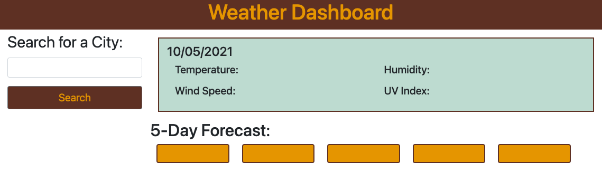
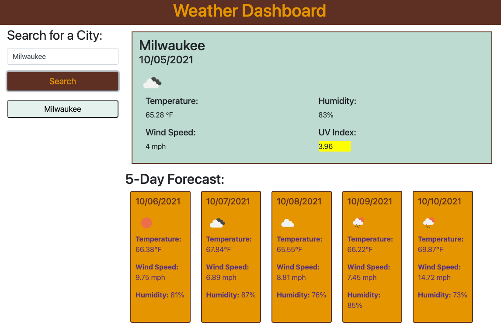
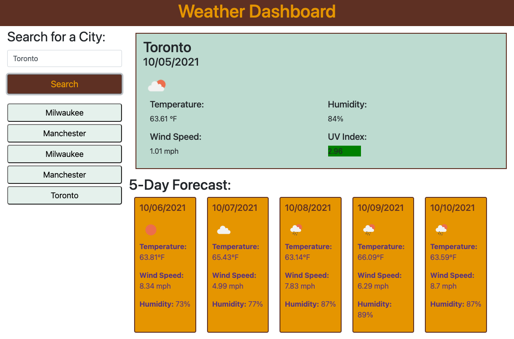
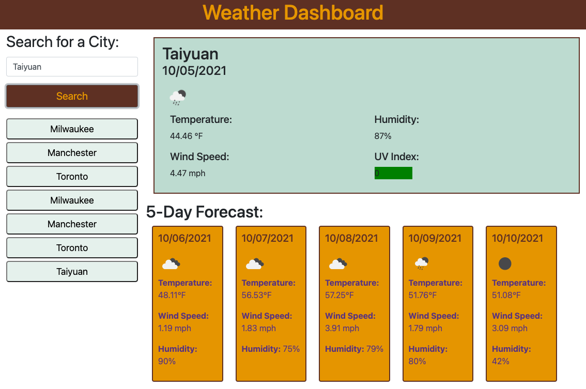

# WEATHER DASHBOARD

## TABLE OF CONTENTS
--------------------

* Introduction
* User Instructions
* Special Features
* Technologies used
* Updates
* Maintainers

## INTRODUCTION
---------------

Weather Dashboard is a simple and effective weather app, in which you can search for a city and find the current weather as well as the weather for the next five days.

## USER INSTRUCTIONS
--------------------

1. Enter the name of a city
2. Click search
3. Find current weather data to the right of the search box
4. Find a 5-day forecast below current weather data
5. Find a list of previously searched cities on the lefthand side, below the search button

## SPECIAL FEATURES
-------------------
1. Weather icons that match the weather of that day
2. UV Index is color-coded to show favorable, moderate, and severe conditions
3. A list of previous city searches

**View the application, here:** [Weather Dashboard](https://grohtech.github.io/weather-dashboard/ "Weather Dashboard")

**View website screenshots, here:**  

 
 

## TECHNOLOGIES USED
--------------------

* HTML
* CSS
* JavaScript
* Git
* APIs
* Bootstrap
* Moment.js

## UPDATES
----------

* **10.05.21 - Release Date**
    * Created GitHub repo
    * Created files
    * Linked CSS/JS, bootstrap, moment.js
    * Set up multiple fetch requests from OpenWeatherMap API
    * Added current date, as well as dates for 5-day forecast 
    * Added weather icons to match the conditions of that day
    * Color-coded UV-Index to match severity of conditions
    * Saved city searches to localStorage

## MAINTAINERS
--------------

**Current maintainers**
1. Lauren Groh - [GitHub](https://github.com/GrohTech "GitHub Profile")